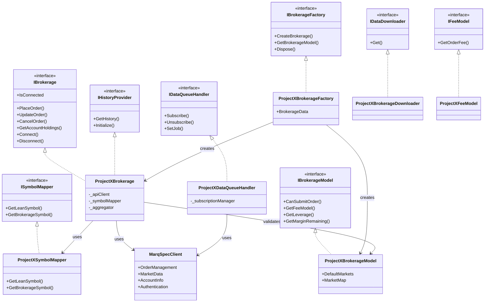
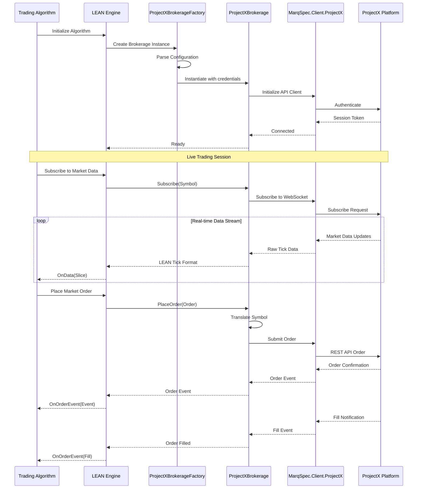

# ProjectX Lean Brokerage Integration

**Status:** Phase 1 - Foundation Complete | Phase 2 - Core Trading (Planning)  
**Last Updated:** March 25, 2026
**Project Lead:** Marquette Speculations  
**Repository:** https://github.com/adammarquette/Lean.Brokerages.ProjectX

## Executive Summary

The ProjectX Lean Brokerage is a comprehensive integration solution that enables algorithmic trading of futures contracts with the ProjectX platform through the QuantConnect LEAN Engine. This integration provides seamless connectivity between LEAN's backtesting and live trading capabilities with ProjectX's trading infrastructure, focusing initially on futures markets with the architecture designed for future expansion to additional asset classes.

## Project Scope

### Motivation
The LEAN engine currently lacks native support for the ProjectX trading platform, preventing student algorithmic traders from leveraging ProjectX's (and the Prop Firms it supports) competitive advantages:
- Advanced futures market access
- Competitive commission structures
- Real-time market data feeds
- Institutional-grade execution infrastructure

This integration bridges that gap, allowing quantitative traders to execute their LEAN-developed strategies directly on ProjectX while maintaining full compatibility with LEAN's ecosystem.

### Primary Objectives
1. **Full Brokerage Integration** - Implement all required LEAN interfaces following [contribution guidelines](https://www.quantconnect.com/docs/v2/lean-engine/contributions/brokerages)
2. **Futures Trading Support** - Enable comprehensive futures contract trading with accurate symbol mapping and contract specifications
3. **Data Pipeline** - Provide real-time market data streaming and historical data access for backtesting
4. **Production Ready** - Deliver enterprise-grade code with comprehensive testing, error handling, and logging
5. **Documentation** - Create complete user and developer documentation for adoption and maintenance

### Initial Scope
**Phase 1-4 Focus:** Futures contracts only
- Symbol mapping for futures tickers
- Market data for futures (real-time and historical)
- Order execution for futures contracts
- Margin calculations specific to futures

### Target Users
- **Quantitative Traders** - Professionals developing and deploying algorithmic futures strategies
- **Systematic Traders** - Traders operating rule-based systems requiring automated execution
- **Research Teams** - Quantitative researchers needing access to ProjectX futures data
- **Technology Partners** - Developers integrating LEAN with ProjectX infrastructure

### Key Assumptions & Constraints

#### Assumptions
1. **API Stability** - MarqSpec.Client.ProjectX API maintains backward compatibility during Phases 2-8
2. **Market Access** - Users have valid ProjectX accounts with futures trading permissions
3. **Network Reliability** - Stable internet connectivity for WebSocket and REST API communication
4. **Data Availability** - ProjectX provides sufficient historical data depth for LEAN's requirements

#### Constraints
1. **Rate Limits** - ProjectX API rate limiting may impact data download speeds and order submission frequency
2. **Asset Support** - Initial release limited to futures contracts supported by ProjectX
3. **Market Hours** - Trading restricted to ProjectX-supported futures market hours
4. **.NET Version** - Requires .NET 10 compatibility with LEAN Engine

### Success Criteria
- [ ] All LEAN interface contracts fully implemented
- [ ] Integration test suite with >90% code coverage
- [ ] Successful paper trading for minimum 30 days without critical errors
- [ ] Live trading validation with real account
- [ ] Documentation approved by code review
- [ ] Performance benchmarks meeting LEAN standards (< 100ms order latency, < 1s data lag)

## Technical Architecture

### Core Components

Following LEAN's brokerage architecture, this integration implements:

#### 1. IBrokerageFactory
**Purpose:** Initialize and configure the brokerage instance
- Parse configuration from job packets
- Instantiate brokerage with proper credentials
- Manage brokerage lifecycle

#### 2. IBrokerage
**Purpose:** Core trading functionality
- Order placement, modification, and cancellation
- Account and holdings synchronization
- Connection state management
- Real-time order and fill event handling

#### 3. ISymbolMapper
**Purpose:** Symbol translation between LEAN and ProjectX formats
- Convert ProjectX ticker format to LEAN Symbol objects (e.g., "ESH25" → Future Symbol)
- Handle reverse mapping for order submission (LEAN Symbol → ProjectX ticker)
- **Initial Focus:** Futures contracts with standard and non-standard symbols
- Parse contract specifications (expiration, strike, underlying)
- Support market identification and routing

#### 4. IBrokerageModel
**Purpose:** Define brokerage capabilities and constraints
- **Order Types:** Market, Limit, Stop Market, Stop Limit (futures-specific)
- **Time-in-Force:** Day, GTC, IOC, FOK (as supported by ProjectX)
- **Margin Requirements:** Initial and maintenance margin for futures
- **Contract Specifications:** Tick size, multiplier, settlement rules
- **Market Hours:** Futures trading sessions (regular, extended, electronic)
- **Buying Power:** Real-time margin calculation for position sizing

#### 5. IDataQueueHandler
**Purpose:** Real-time market data streaming
- Subscribe/unsubscribe to market data feeds
- Stream tick data (Trade, Quote, OpenInterest)
- Handle data aggregation for various resolutions

#### 6. IHistoryProvider
**Purpose:** Historical data retrieval
- Fetch historical data for backtesting and warm-up
- Support multiple resolutions (Tick, Second, Minute, Hour, Daily)
- Handle date range queries

#### 7. IDataDownloader (ToolBox)
**Purpose:** Bulk data downloads
- Download historical data to local storage
- Convert to LEAN format
- Support data universe generation

#### 8. IFeeModel
**Purpose:** Accurate fee calculations for futures trading
- **Commission Structure:** Per-contract commission modeling
- **Exchange Fees:** Pass-through fees (CME, CBOT, NYMEX, etc.)
- **Regulatory Fees:** NFA, clearing fees
- **Slippage Modeling:** Market impact estimation
- **Round-Turn vs Per-Side:** Support both commission models

## External Dependencies

### LEAN Engine
The core algorithmic trading engine that provides:
- Strategy backtesting framework
- Live trading infrastructure  
- Data management and normalization
- Risk management and portfolio construction tools

**Reference:** https://github.com/QuantConnect/Lean  
**Version Compatibility:** .NET 10  
**Key Integration Points:**
- `Lean/Brokerages/` - Brokerage implementations
- `Lean/ToolBox/` - Data download utilities
- `Lean/Common/` - Core interfaces and models

### MarqSpec.Client.ProjectX
A C# client library providing programmatic access to ProjectX's trading API, serving as the communication layer between LEAN and ProjectX.

**Reference:** https://github.com/adammarquette/MarqSpec.Client.ProjectX  
**Language:** C# (.NET compatible)  
**License:** [Verify from repository]

**Repository Structure:**
- `MarqSpec.Client.ProjectX/` - Core API client library
- `MarqSpec.Client.ProjectX.Samples/` - Usage examples and patterns
- `MarqSpec.Client.ProjectX.Tests/` - Integration and unit tests
- `MarqSpec.Client.ProjectX.Diagnostics/` - API health checks and debugging tools

**Key Capabilities:**
1. **Authentication & Session Management**
   - OAuth/API key authentication
   - Token refresh and session persistence
   - Connection state monitoring

2. **Market Data Services**
   - Real-time tick data (WebSocket)
   - Historical data queries (REST API)
   - Contract specifications and expiration calendars
   - Market depth (Level II data, if available)

3. **Order Management**
   - Order placement (all supported types)
   - Order modification and cancellation
   - Order status tracking and fill notifications
   - Bulk order operations

4. **Account & Position Management**
   - Real-time account balance updates
   - Position tracking (open positions, realized/unrealized P&L)
   - Margin availability calculations
   - Trade history and reporting

5. **Contract Discovery**
   - Symbol search and lookup
   - Contract specifications (expiration, multiplier, tick size)
   - Available instruments and markets

**Integration Pattern:**
```
LEAN Brokerage (ProjectXBrokerage)
    ↓
MarqSpec.Client.ProjectX (API Client)
    ↓
ProjectX REST API / WebSocket
```

The brokerage wraps MarqSpec.Client.ProjectX to:
- Translate LEAN data models to/from ProjectX formats
- Handle LEAN-specific lifecycle (Connect/Disconnect)
- Aggregate and normalize market data for LEAN consumption
- Map LEAN order types to ProjectX equivalents
- Provide thread-safe access for concurrent operations

**Version Compatibility:**
- Target latest stable version of MarqSpec.Client.ProjectX
- Monitor for breaking changes during development
- Pin to specific version for production deployments

## Implementation Phases

### Phase 1: Foundation Setup ✅ COMPLETE
- [x] Repository initialization and structure
- [x] Project naming conventions (ProjectXBrokerage)
- [x] Basic factory stub (IBrokerageFactory)
- [x] Basic brokerage stub (IBrokerage)
- [x] Project references and dependencies
- [x] Build system configuration (.NET 10)
- [x] Initial documentation (README, PRD)
- [ ] Configuration schema definition (config.json)
- [ ] Logging infrastructure setup

**Deliverables:**
- ✅ Compilable solution with proper project structure
- ✅ Factory creates brokerage instance (stub)
- ✅ PRD and architecture documentation
- ⏳ Configuration file schema

### Phase 2: Core Trading Implementation 🔄 IN PROGRESS
**Objective:** Implement core IBrokerage interface for order execution and account management

**Tasks:**
- [ ] **Connection Management**
  - [ ] Implement `Connect()` - Initialize MarqSpec.Client connection
  - [ ] Implement `Disconnect()` - Graceful shutdown
  - [ ] Implement `IsConnected` property - Real-time connection state
  - [ ] Connection retry logic with exponential backoff
  - [ ] WebSocket reconnection handling

- [ ] **Order Management**
  - [ ] `PlaceOrder()` - Submit orders to ProjectX
  - [ ] `UpdateOrder()` - Modify existing orders (if supported)
  - [ ] `CancelOrder()` - Cancel pending orders
  - [ ] `GetOpenOrders()` - Query active orders
  - [ ] Order validation before submission
  - [ ] Order ID mapping (LEAN ↔ ProjectX)

- [ ] **Account Synchronization**
  - [ ] `GetAccountHoldings()` - Current positions
  - [ ] `GetCashBalance()` - Available funds
  - [ ] Account update event handling
  - [ ] Position reconciliation on connect

- [ ] **Event Handling**
  - [ ] Order status change events
  - [ ] Fill notifications
  - [ ] Error/rejection events
  - [ ] Account update events

- [ ] **Error Handling & Logging**
  - [ ] Comprehensive exception handling
  - [ ] Structured logging (Serilog/NLog)
  - [ ] Error code translation (ProjectX → LEAN)

**Deliverables:**
- [ ] Fully functional order execution
- [ ] Real-time account state synchronization
- [ ] Unit tests for all IBrokerage methods
- [ ] Integration tests with MarqSpec.Client.ProjectX test environment

### Phase 3: Symbol Mapping 🔜 NEXT
**Objective:** Translate between ProjectX and LEAN symbol formats

**Tasks:**
- [ ] **ISymbolMapper Implementation**
  - [ ] `GetLeanSymbol()` - ProjectX ticker → LEAN Symbol
  - [ ] `GetBrokerageSymbol()` - LEAN Symbol → ProjectX ticker
  - [ ] Parse futures ticker formats (ES, NQ, CL, etc.)
  - [ ] Handle expiration date encoding
  - [ ] Support market/exchange identification

- [ ] **Futures Symbol Support**
  - [ ] Standard futures contracts (ESH25, NQM25)
  - [ ] Continuous contracts (if applicable)
  - [ ] Handle month codes (F=Jan, G=Feb, etc.)
  - [ ] Parse contract year (2025 → 25)

- [ ] **Market Mapping**
  - [ ] CME futures
  - [ ] CBOT futures
  - [ ] NYMEX/COMEX futures
  - [ ] ICE futures (if supported)

- [ ] **Testing & Validation**
  - [ ] Unit tests for all symbol formats
  - [ ] Round-trip conversion tests
  - [ ] Edge case handling (invalid symbols, expired contracts)

**Deliverables:**
- [ ] Production-ready ISymbolMapper
- [ ] Symbol conversion test suite
- [ ] Documentation of supported symbol formats

### Phase 4: Brokerage Model
**Objective:** Define ProjectX-specific trading rules and constraints

**Tasks:**
- [ ] **IBrokerageModel Implementation**
  - [ ] `CanSubmitOrder()` - Validate order before submission
  - [ ] `CanUpdateOrder()` - Check if modification allowed
  - [ ] `CanExecuteOrder()` - Validate execution constraints

- [ ] **Order Type Support**
  - [ ] Market orders
  - [ ] Limit orders
  - [ ] Stop Market orders
  - [ ] Stop Limit orders
  - [ ] Define unsupported order types

- [ ] **Time-in-Force Support**
  - [ ] Day orders
  - [ ] GTC (Good-Till-Cancelled)
  - [ ] IOC (Immediate-or-Cancel)
  - [ ] FOK (Fill-or-Kill)

- [ ] **Margin & Leverage**
  - [ ] Initial margin requirements by contract
  - [ ] Maintenance margin rules
  - [ ] Intraday vs overnight margin
  - [ ] Buying power calculations

- [ ] **Market Hours**
  - [ ] Regular trading hours by exchange
  - [ ] Extended hours (if supported)
  - [ ] Electronic trading sessions
  - [ ] Settlement times

- [ ] **Fee Model Integration**
  - [ ] Link to IFeeModel implementation
  - [ ] Default fee structure

**Deliverables:**
- [ ] Complete IBrokerageModel implementation
- [ ] Comprehensive order validation rules
- [ ] Market hours database
- [ ] Documentation of brokerage constraints

### Phase 5: Live Data Streaming
**Objective:** Real-time market data for live trading

**Tasks:**
- [ ] **IDataQueueHandler Implementation**
  - [ ] `Subscribe()` - Start receiving data for symbol
  - [ ] `Unsubscribe()` - Stop data feed
  - [ ] `SetJob()` - Initialize with algorithm job

- [ ] **WebSocket Integration**
  - [ ] Connect to ProjectX WebSocket feed
  - [ ] Handle subscription management
  - [ ] Process real-time tick data
  - [ ] Reconnection logic

- [ ] **Data Streaming**
  - [ ] Trade ticks (price, volume, timestamp)
  - [ ] Quote ticks (bid, ask, spread)
  - [ ] Open Interest updates (if available)

- [ ] **Data Aggregation**
  - [ ] Integrate with LEAN's IDataAggregator
  - [ ] Support multiple resolutions (Tick, Second, Minute)
  - [ ] Handle data consolidation

- [ ] **Subscription Management**
  - [ ] EventBasedDataQueueHandlerSubscriptionManager
  - [ ] Thread-safe subscription tracking
  - [ ] Concurrent symbol handling

**Deliverables:**
- [ ] Working real-time data feed
- [ ] Subscription test suite
- [ ] Performance benchmarks (latency, throughput)
- [ ] Data quality validation

### Phase 6: Historical Data
**Objective:** Provide historical data for backtesting and warm-up

**Tasks:**
- [ ] **IHistoryProvider Implementation**
  - [ ] `GetHistory()` - Fetch historical data
  - [ ] `Initialize()` - Setup history provider

- [ ] **Data Retrieval**
  - [ ] Query ProjectX historical data API
  - [ ] Handle pagination for large datasets
  - [ ] Support multiple resolutions
  - [ ] Date range validation

- [ ] **Resolution Support**
  - [ ] Tick data (if available)
  - [ ] Second bars
  - [ ] Minute bars
  - [ ] Hour bars
  - [ ] Daily bars

- [ ] **Data Caching**
  - [ ] Cache frequently requested data
  - [ ] Implement cache invalidation strategy
  - [ ] Optimize for backtesting performance

- [ ] **Error Handling**
  - [ ] Handle missing data gaps
  - [ ] Validate data completeness
  - [ ] Retry logic for failed requests

**Deliverables:**
- [ ] Complete IHistoryProvider
- [ ] Historical data test suite
- [ ] Caching strategy documentation
- [ ] Performance benchmarks

### Phase 7: Data Downloads (ToolBox)
**Objective:** Enable bulk historical data downloads

**Tasks:**
- [ ] **IDataDownloader Implementation**
  - [ ] `Get()` - Download data for date range
  - [ ] Support DataDownloaderGetParameters

- [ ] **Bulk Download Utilities**
  - [ ] Command-line tool integration
  - [ ] Batch download for multiple symbols
  - [ ] Progress tracking and resumption

- [ ] **Data Format Conversion**
  - [ ] Convert ProjectX format to LEAN format
  - [ ] Write to LEAN directory structure
  - [ ] Compress data files (zip)

- [ ] **Universe Generation**
  - [ ] Generate futures universe files
  - [ ] Contract expiration calendars
  - [ ] Symbol mapping files

**Deliverables:**
- [ ] Functional data downloader
- [ ] ToolBox command-line interface
- [ ] Download scripts and documentation
- [ ] Sample universe files

### Phase 8: Fee Modeling
**Objective:** Accurate commission and fee calculations

**Tasks:**
- [ ] **IFeeModel Implementation**
  - [ ] `GetOrderFee()` - Calculate total fees for order

- [ ] **Commission Structure**
  - [ ] Per-contract commission rates
  - [ ] Volume-based tiering (if applicable)
  - [ ] Round-turn vs per-side modeling

- [ ] **Exchange Fees**
  - [ ] CME fees by product
  - [ ] CBOT fees
  - [ ] NYMEX/COMEX fees
  - [ ] Pass-through fee structure

- [ ] **Regulatory Fees**
  - [ ] NFA fees
  - [ ] Clearing fees
  - [ ] Section 31 fees (if applicable)

- [ ] **Slippage Modeling**
  - [ ] Market impact estimation
  - [ ] Bid-ask spread costs
  - [ ] Configurable slippage model

**Deliverables:**
- [ ] Complete IFeeModel
- [ ] Fee calculation test suite
- [ ] Documentation of fee structure
- [ ] Fee configuration examples

### Phase 9: Testing & Documentation
**Objective:** Comprehensive testing and documentation

**Tasks:**
- [ ] **Unit Testing**
  - [ ] Unit tests for all components (target >90% coverage)
  - [ ] Mock MarqSpec.Client for isolated testing
  - [ ] Edge case and error condition tests
  - [ ] Thread safety tests

- [ ] **Integration Testing**
  - [ ] Tests against ProjectX sandbox/test environment
  - [ ] End-to-end order execution tests
  - [ ] Data streaming validation tests
  - [ ] Account synchronization tests
  - [ ] Historical data accuracy tests

- [ ] **Regression Testing**
  - [ ] LEAN standard brokerage test suite
  - [ ] `BrokerageTests` base class implementation
  - [ ] Order type test scenarios
  - [ ] Symbol mapping regression tests

- [ ] **Performance Testing**
  - [ ] Order latency benchmarks
  - [ ] Data streaming throughput tests
  - [ ] Memory usage profiling
  - [ ] Concurrent operation stress tests

- [ ] **User Documentation**
  - [ ] Setup and configuration guide
  - [ ] API reference documentation
  - [ ] Code examples and samples
  - [ ] Troubleshooting guide
  - [ ] FAQ

- [ ] **Developer Documentation**
  - [ ] Architecture overview
  - [ ] Code organization and patterns
  - [ ] Extension points
  - [ ] Contributing guidelines
  - [ ] Release notes

**Deliverables:**
- [ ] Test suite with >90% coverage
- [ ] All LEAN brokerage tests passing
- [ ] Complete user documentation
- [ ] Developer documentation
- [ ] Performance benchmark report

### Phase 10: Deployment & Release
**Objective:** Production readiness and release

**Tasks:**
- [ ] **Code Review & QA**
  - [ ] Internal code review
  - [ ] Security audit
  - [ ] Performance review
  - [ ] Documentation review
  - [ ] LEAN team code review

- [ ] **Production Readiness**
  - [ ] Paper trading validation (30+ days)
  - [ ] Live account validation
  - [ ] Failover and recovery testing
  - [ ] Monitoring and alerting setup

- [ ] **Repository Preparation**
  - [ ] Clean commit history
  - [ ] Remove sensitive data
  - [ ] Finalize README
  - [ ] License verification
  - [ ] Changelog preparation

- [ ] **LEAN Integration**
  - [ ] Pull request to LEAN repository
  - [ ] Address review feedback
  - [ ] Merge to LEAN master branch
  - [ ] LEAN release coordination

- [ ] **QuantConnect Cloud** (Optional)
  - [ ] Cloud integration assessment
  - [ ] Cloud-specific configuration
  - [ ] Cloud deployment testing
  - [ ] Cloud documentation

- [ ] **Release & Versioning**
  - [ ] Version tagging (v1.0.0)
  - [ ] GitHub release notes
  - [ ] NuGet package (if applicable)
  - [ ] Announcement and promotion

**Deliverables:**
- [ ] Merged to LEAN master
- [ ] Public release (GitHub)
- [ ] Complete documentation
- [ ] Community support plan

## Development Guidelines

### Code Style & Standards
- **LEAN Coding Standards:** Follow [LEAN contribution guidelines](https://github.com/QuantConnect/Lean/blob/master/CONTRIBUTING.md#code-style-and-testing)
- **Naming Conventions:** PascalCase for public members, _camelCase for private fields
- **XML Documentation:** Required for all public APIs and interfaces
- **Code Comments:** Explain complex logic, avoid obvious comments
- **Async/Await:** Use async patterns for I/O operations
- **Null Handling:** Proper null checks and nullable reference types
- **Exception Handling:** Specific exceptions, avoid catching generic Exception
- **Logging:** Structured logging with appropriate severity levels

### Testing Standards
- **Unit Tests:** 
  - Test coverage >90% for all production code
  - Use NUnit testing framework
  - Mock external dependencies (MarqSpec.Client.ProjectX)
  - Test both success and failure scenarios
  - Include edge cases and boundary conditions

- **Integration Tests:**
  - Test against ProjectX sandbox/test environment
  - Validate end-to-end workflows
  - Test data accuracy and consistency
  - Performance benchmarks

- **Regression Tests:**
  - Inherit from LEAN's `BrokerageTests` base class
  - Implement all required test methods
  - Test all supported order types
  - Validate symbol mapping round-trips

- **Test Organization:**
  ```
  QuantConnect.ProjectXBrokerage.Tests/
  ├── ProjectXBrokerageTests.cs (regression)
  ├── ProjectXSymbolMapperTests.cs (unit)
  ├── ProjectXBrokerageModelTests.cs (unit)
  ├── ProjectXDataQueueHandlerTests.cs (integration)
  └── ProjectXHistoryProviderTests.cs (integration)
  ```

### Security Best Practices
- **Credential Management:**
  - Never commit API keys or secrets to repository
  - Use environment variables or secure configuration
  - Support credential encryption in config files
  - Clear sensitive data from memory after use

- **API Communication:**
  - Always use HTTPS/WSS
  - Validate SSL certificates
  - Implement request signing if required
  - Rate limit handling and backoff

- **Error Messages:**
  - Never expose sensitive data in logs
  - Sanitize error messages before logging
  - Use secure exception handling

- **Dependency Security:**
  - Regular security audits of NuGet packages
  - Keep dependencies up to date
  - Monitor for CVEs

### Performance Considerations
- **Connection Management:**
  - Reuse connections where possible
  - Implement connection pooling
  - Handle reconnection gracefully
  - Monitor connection health

- **Threading:**
  - Thread-safe implementations required
  - Use concurrent collections where appropriate
  - Avoid blocking operations on hot paths
  - Proper disposal of resources

- **Memory Management:**
  - Dispose IDisposable objects properly
  - Avoid memory leaks in event handlers
  - Monitor memory usage under load
  - Implement object pooling for high-frequency operations

- **Data Streaming:**
  - Efficient data structure selection
  - Minimize allocations in hot paths
  - Buffer management for WebSocket data
  - Back-pressure handling

### Logging Strategy
- **Log Levels:**
  - `Trace`: Detailed diagnostic information (dev only)
  - `Debug`: Debugging information (dev/staging)
  - `Information`: General informational messages
  - `Warning`: Unexpected behavior that doesn't prevent operation
  - `Error`: Errors that prevent operation but allow recovery
  - `Critical`: Failures requiring immediate attention

- **What to Log:**
  - Connection state changes
  - Order submissions and status changes
  - Data subscription events
  - Error conditions and exceptions
  - Performance metrics
  - Configuration changes

- **What NOT to Log:**
  - API keys or credentials
  - Full order details with sensitive info
  - Personal account information
  - Raw API responses with sensitive data

### Version Control
- **Branching Strategy:**
  - `master`: Production-ready code
  - `develop`: Integration branch
  - `feature/*`: Feature development
  - `bugfix/*`: Bug fixes
  - `release/*`: Release preparation

- **Commit Messages:**
  - Clear, descriptive commit messages
  - Reference issue numbers where applicable
  - Follow conventional commits format

- **Pull Requests:**
  - Descriptive PR title and description
  - Link to related issues
  - Include test results
  - Request reviews from maintainers

## Risk Management & Mitigation

### Technical Risks

| Risk | Impact | Probability | Mitigation Strategy |
|------|--------|-------------|---------------------|
| **MarqSpec.Client.ProjectX Breaking Changes** | High | Medium | Pin to stable version; monitor repository; maintain version compatibility matrix |
| **ProjectX API Changes** | High | Medium | Regular communication with ProjectX; version API calls; maintain backward compatibility |
| **Rate Limiting** | Medium | High | Implement request throttling; queue management; user documentation on limits |
| **WebSocket Disconnections** | High | Medium | Automatic reconnection; connection monitoring; graceful degradation |
| **Data Quality Issues** | Medium | Medium | Validation layer; data quality monitoring; alert on anomalies |
| **Performance Degradation** | Medium | Low | Performance testing; monitoring; optimization hot paths |
| **Memory Leaks** | Medium | Low | Profiling; code review; dispose pattern; automated testing |

### Business Risks

| Risk | Impact | Probability | Mitigation Strategy |
|------|--------|-------------|---------------------|
| **Limited Adoption** | Medium | Medium | Comprehensive documentation; community engagement; support channels |
| **ProjectX Platform Changes** | High | Low | Diversify development; maintain flexibility; community communication |
| **Support Burden** | Medium | Medium | Clear documentation; FAQ; community support; issue templates |
| **Regulatory Changes** | Low | Low | Monitor regulatory landscape; design for compliance flexibility |

### Operational Risks

| Risk | Impact | Probability | Mitigation Strategy |
|------|--------|-------------|---------------------|
| **Incomplete Testing** | High | Medium | Comprehensive test plan; code coverage requirements; paper trading validation |
| **Security Vulnerabilities** | High | Low | Security audits; dependency scanning; secure coding practices |
| **Documentation Gaps** | Medium | High | Documentation requirements in DoD; peer review; user feedback |
| **Maintenance Costs** | Medium | Medium | Clean code; good architecture; automated testing; community contributions |

## Risk Management & Mitigation

### Technical Risks

| Risk | Impact | Probability | Mitigation Strategy |
|------|--------|-------------|---------------------|
| **MarqSpec.Client.ProjectX Breaking Changes** | High | Medium | Pin to stable version; monitor repository; maintain version compatibility matrix |
| **ProjectX API Changes** | High | Medium | Regular communication with ProjectX; version API calls; maintain backward compatibility |
| **Rate Limiting** | Medium | High | Implement request throttling; queue management; user documentation on limits |
| **WebSocket Disconnections** | High | Medium | Automatic reconnection; connection monitoring; graceful degradation |
| **Data Quality Issues** | Medium | Medium | Validation layer; data quality monitoring; alert on anomalies |
| **Performance Degradation** | Medium | Low | Performance testing; monitoring; optimization hot paths |
| **Memory Leaks** | Medium | Low | Profiling; code review; dispose pattern; automated testing |

### Business Risks

| Risk | Impact | Probability | Mitigation Strategy |
|------|--------|-------------|---------------------|
| **Limited Adoption** | Medium | Medium | Comprehensive documentation; community engagement; support channels |
| **ProjectX Platform Changes** | High | Low | Diversify development; maintain flexibility; community communication |
| **Support Burden** | Medium | Medium | Clear documentation; FAQ; community support; issue templates |
| **Regulatory Changes** | Low | Low | Monitor regulatory landscape; design for compliance flexibility |

### Operational Risks

| Risk | Impact | Probability | Mitigation Strategy |
|------|--------|-------------|---------------------|
| **Incomplete Testing** | High | Medium | Comprehensive test plan; code coverage requirements; paper trading validation |
| **Security Vulnerabilities** | High | Low | Security audits; dependency scanning; secure coding practices |
| **Documentation Gaps** | Medium | High | Documentation requirements in DoD; peer review; user feedback |
| **Maintenance Costs** | Medium | Medium | Clean code; good architecture; automated testing; community contributions |

## Success Metrics & KPIs

### Technical Metrics
- [ ] **Code Quality**
  - [ ] Unit test coverage >90%
  - [ ] Integration test coverage >80%
  - [ ] Zero critical security vulnerabilities
  - [ ] Code review approval from LEAN maintainers

- [ ] **Functionality**
  - [ ] All LEAN IBrokerage interface methods implemented
  - [ ] All required LEAN brokerage tests passing
  - [ ] Support for minimum 10 popular futures contracts
  - [ ] All major order types working (Market, Limit, Stop, StopLimit)

- [ ] **Performance**
  - [ ] Order submission latency <100ms (p95)
  - [ ] Market data lag <1 second (p99)
  - [ ] Historical data query response <5 seconds for 1 year daily data
  - [ ] Memory usage stable under sustained load
  - [ ] Zero memory leaks detected

- [ ] **Reliability**
  - [ ] 30+ days paper trading without critical errors
  - [ ] Successful reconnection after network disruption
  - [ ] Graceful handling of API rate limits
  - [ ] 99.9% uptime during trading hours (after deployment)

### Business Metrics
- [ ] **Adoption**
  - [ ] Successful live trading with real account (validation)
  - [ ] 10+ community users testing in first month
  - [ ] Positive feedback from beta testers
  - [ ] Merged to LEAN master branch

- [ ] **Documentation**
  - [ ] Complete user setup guide
  - [ ] API documentation for all public interfaces
  - [ ] Minimum 5 example algorithms
  - [ ] Troubleshooting guide with common issues
  - [ ] Documentation completeness score >90%

- [ ] **Support**
  - [ ] Average issue response time <48 hours
  - [ ] 90% of issues resolved within 2 weeks
  - [ ] Active community discussions
  - [ ] Regular updates and maintenance

### Acceptance Criteria
To consider the project complete and ready for release:
1. ✅ All Phase 1-9 tasks completed
2. ⬜ Code review approved by LEAN maintainers
3. ⬜ All automated tests passing (unit, integration, regression)
4. ⬜ 30-day paper trading validation successful
5. ⬜ Live trading validation completed
6. ⬜ Security audit passed
7. ⬜ Performance benchmarks met
8. ⬜ Documentation peer-reviewed and approved
9. ⬜ No critical or high-priority bugs outstanding
10. ⬜ Community beta testing feedback addressed

## References

- [LEAN Brokerage Contribution Guide](https://www.quantconnect.com/docs/v2/lean-engine/contributions/brokerages)
- [LEAN Repository](https://github.com/QuantConnect/Lean)
- [LEAN Brokerage Template](https://github.com/QuantConnect/Lean.Brokerages.Template/blob/master/README.md)
- [MarqSpec.Client.ProjectX Repository](https://github.com/adammarquette/MarqSpec.Client.ProjectX)
- [QuantConnect Documentation](https://www.quantconnect.com/docs/v2/)

## Appendix

### Configuration Example
```json
{
  "job-project-id": "0",
  "environment": "live",
  "algorithm-type-name": "BasicTemplateAlgorithm",
  "algorithm-language": "CSharp",
  "parameters": {},
  "brokerage": "ProjectXBrokerage",
  "brokerage-project-x-api-key": "your-api-key",
  "brokerage-project-x-api-secret": "your-api-secret",
  "data-queue-handler": "ProjectXBrokerage"
}
```

### Architecture Diagram

```mermaid
graph TB
    subgraph "User Layer"
        User[Trading Algorithm]
        Config[Configuration<br/>API Keys, Settings]
    end

    subgraph "LEAN Engine Core"
        AlgoFramework[Algorithm Framework]
        DataManager[Data Manager]
        OrderManager[Order Manager]
        PortfolioManager[Portfolio Manager]
    end

    subgraph "ProjectX Brokerage Integration"
        Factory[ProjectXBrokerageFactory<br/>IBrokerageFactory]
        
        subgraph "Core Trading Components"
            Brokerage[ProjectXBrokerage<br/>IBrokerage]
            SymbolMapper[ProjectXSymbolMapper<br/>ISymbolMapper]
            BrokerageModel[ProjectXBrokerageModel<br/>IBrokerageModel]
        end
        
        subgraph "Data Components"
            DataQueue[ProjectXDataQueueHandler<br/>IDataQueueHandler]
            HistoryProvider[ProjectXHistoryProvider<br/>IHistoryProvider]
            DataDownloader[ProjectXDataDownloader<br/>IDataDownloader]
        end
        
        subgraph "Fee Model"
            FeeModel[ProjectXFeeModel<br/>IFeeModel]
        end
    end

    subgraph "API Client Layer"
        APIClient[MarqSpec.Client.ProjectX<br/>API Client Library]
        
        subgraph "Client Modules"
            AuthModule[Authentication]
            OrderModule[Order Management]
            MarketDataModule[Market Data]
            AccountModule[Account & Positions]
        end
    end

    subgraph "ProjectX Platform"
        API[ProjectX REST API]
        WS[ProjectX WebSocket]
        Platform[Trading Infrastructure]
    end

    %% User to LEAN connections
    User -->|Creates & Runs| AlgoFramework
    Config -->|Loads| Factory
    
    %% LEAN to Integration connections
    AlgoFramework -->|Requests Data| DataManager
    AlgoFramework -->|Places Orders| OrderManager
    AlgoFramework -->|Queries Portfolio| PortfolioManager
    
    DataManager -->|Subscribe/Stream| DataQueue
    DataManager -->|Historical Requests| HistoryProvider
    OrderManager -->|Execute Orders| Brokerage
    PortfolioManager -->|Account Sync| Brokerage
    
    %% Factory connections
    Factory -->|Instantiates| Brokerage
    Factory -->|Configures| DataQueue
    Factory -->|Configures| HistoryProvider
    
    %% Integration internal connections
    Brokerage -->|Translates Symbols| SymbolMapper
    Brokerage -->|Validates Orders| BrokerageModel
    Brokerage -->|Calculates Fees| FeeModel
    DataQueue -->|Maps Symbols| SymbolMapper
    HistoryProvider -->|Maps Symbols| SymbolMapper
    
    %% Integration to Client connections
    Brokerage -->|Order Operations| APIClient
    Brokerage -->|Account Sync| APIClient
    DataQueue -->|Real-time Data| APIClient
    HistoryProvider -->|Historical Data| APIClient
    DataDownloader -->|Bulk Downloads| APIClient
    
    %% Client internal
    APIClient -->|Uses| AuthModule
    APIClient -->|Uses| OrderModule
    APIClient -->|Uses| MarketDataModule
    APIClient -->|Uses| AccountModule
    
    %% Client to Platform
    AuthModule -->|Authenticates| API
    OrderModule -->|REST Calls| API
    MarketDataModule -->|Streams| WS
    MarketDataModule -->|Queries| API
    AccountModule -->|Queries| API
    
    API -->|Connected to| Platform
    WS -->|Connected to| Platform

    %% Styling
    classDef userLayer fill:#e1f5ff,stroke:#01579b,stroke-width:2px
    classDef leanLayer fill:#fff3e0,stroke:#e65100,stroke-width:2px
    classDef integrationLayer fill:#f3e5f5,stroke:#4a148c,stroke-width:2px
    classDef clientLayer fill:#e8f5e9,stroke:#1b5e20,stroke-width:2px
    classDef platformLayer fill:#fce4ec,stroke:#880e4f,stroke-width:2px
    
    class User,Config userLayer
    class AlgoFramework,DataManager,OrderManager,PortfolioManager leanLayer
    class Factory,Brokerage,SymbolMapper,BrokerageModel,DataQueue,HistoryProvider,DataDownloader,FeeModel integrationLayer
    class APIClient,AuthModule,OrderModule,MarketDataModule,AccountModule clientLayer
    class API,WS,Platform platformLayer
```



### Class Diagram



### Sequence Diagram




### Contact & Support
- **Repository:** https://github.com/adammarquette/Lean.Brokerages.ProjectX
- **Issues:** Use GitHub Issues for bug reports and feature requests
- **Discussions:** Use GitHub Discussions for questions and community support
- **Email:** [Add contact email if applicable]
- **Discord:** [Add Discord channel if applicable]

### FAQ

**Q: Which futures contracts are supported?**  
A: The integration supports all futures contracts available through the ProjectX platform. Initial testing focuses on major contracts (ES, NQ, CL, GC).

**Q: Can I use this with QuantConnect Cloud?**  
A: Cloud integration is optional (Phase 10). The integration is primarily designed for local LEAN deployment.

**Q: What are the performance characteristics?**  
A: Target metrics: <100ms order latency (p95), <1s data lag (p99). Actual performance depends on network and ProjectX infrastructure.

**Q: How do I report bugs or request features?**  
A: Use GitHub Issues with appropriate templates. Include LEAN version, .NET version, and reproducible steps.

**Q: Is this production-ready?**  
A: After Phase 10 completion and passing all acceptance criteria, yes. Until then, use for development and testing only.

**Q: How do fees work?**  
A: The integration implements ProjectX's fee structure. See Phase 8 and IFeeModel documentation for details.

**Q: Can I contribute to development?**  
A: Yes! See CONTRIBUTING.md for guidelines. Focus areas are listed in the current phase tasks.

### Glossary

| Term | Definition |
|------|------------|
| **LEAN** | QuantConnect's open-source algorithmic trading engine |
| **ProjectX** | Trading platform providing futures market access |
| **MarqSpec.Client.ProjectX** | C# API client library for ProjectX |
| **IBrokerage** | LEAN interface for brokerage operations |
| **ISymbolMapper** | LEAN interface for symbol translation |
| **IDataQueueHandler** | LEAN interface for real-time data |
| **IHistoryProvider** | LEAN interface for historical data |
| **Futures Contract** | Derivative contract to buy/sell asset at future date |
| **Tick Data** | Individual trade or quote data points |
| **WebSocket** | Protocol for real-time bi-directional communication |
| **REST API** | HTTP-based API for request/response operations |
| **Market Data** | Price, volume, and other trading information |
| **Order Book** | Collection of buy/sell orders at various prices |

### Change Log

#### v0.1.0 - Initial Setup (January 2025)
- Repository structure initialized
- Basic factory and brokerage stubs
- Project references configured
- PRD and architecture documentation

#### v0.2.0 - Core Trading (Planned)
- IBrokerage implementation
- Order management
- Account synchronization
- Connection handling

*See GitHub Releases for detailed changelogs*

---

**Document Version:** 2.0  
**Last Updated:** January 2025  
**Next Review:** After Phase 2 Completion